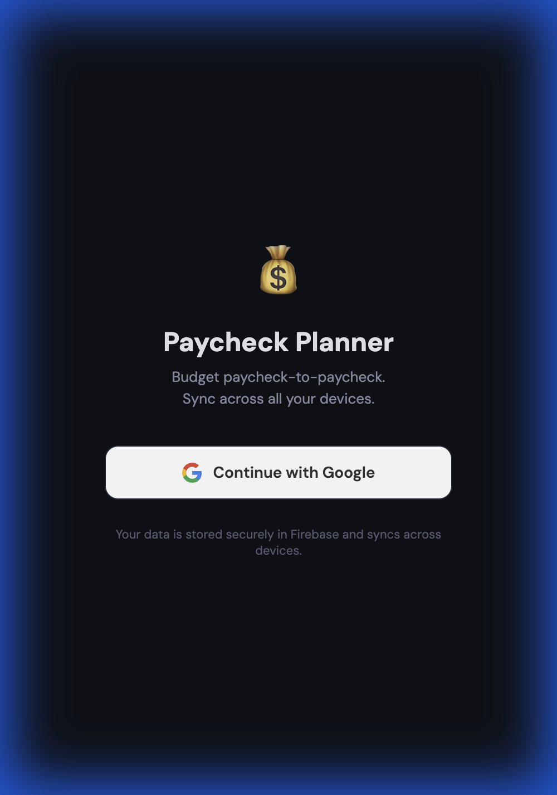
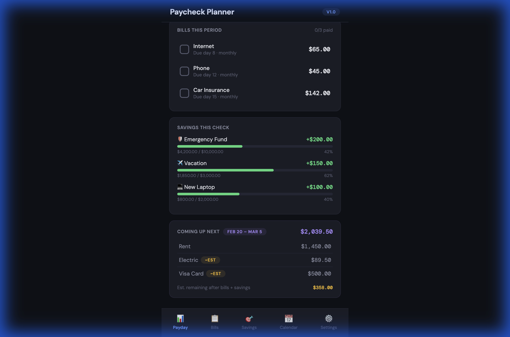
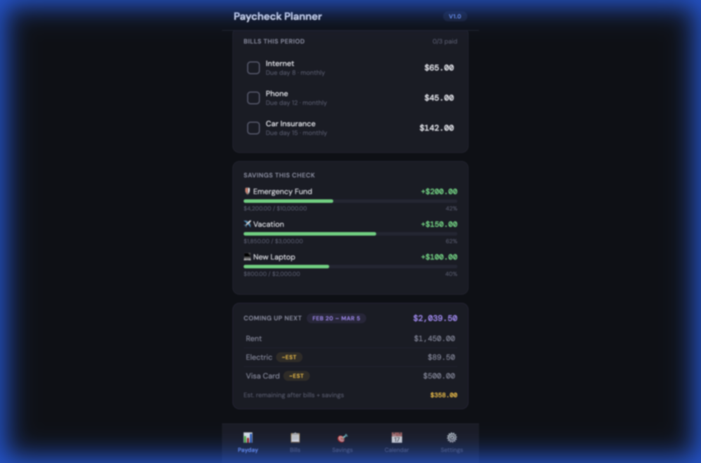
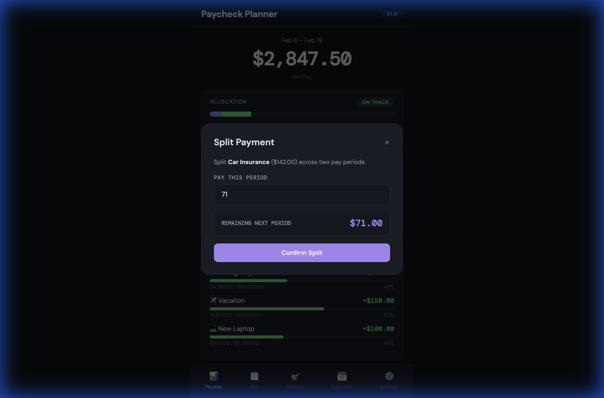
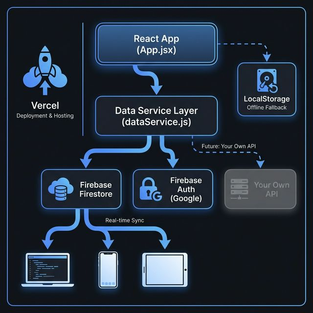

# 💰 Paycheck Planner

A paycheck-to-paycheck budgeting app that helps you allocate each paycheck across bills, savings goals, and adjustments — with cross-device sync via Firebase.

🔗 **Live:** [paycheck-planner-eight.vercel.app](https://paycheck-planner-eight.vercel.app)

## 📸 Screenshots

<p align="center">
  
  
</p>
<p align="center">
  
  
</p>

## ✨ Features

- **Google sign-in** — Secure authentication, data syncs across all your devices
- **Per-period bill tracking** — Mark bills as paid, see what's due this period vs next
- **Split payments** — Split a bill across two pay periods
- **Defer bills** — Push a bill to the next period
- **Partial prepayments** — Pay part of an upcoming bill early to lighten the load next period
- **Pay early** — Pull a future bill into the current period
- **Savings goals** — Set goals with per-check contributions and track progress
- **Editable paycheck amount** — Override the default net pay on a per-period basis
- **One-off adjustments** — Add freelance income, unexpected expenses, or refunds
- **Allocation dashboard** — Visual breakdown of bills vs savings vs remaining
- **Calendar view** — See when bills are due at a glance
- **Period history** — Track savings across past paychecks with averages and best-check stats
- **Offline support** — LocalStorage fallback keeps the app working without internet

## 🏗 Architecture

<p align="center">
  
</p>

The app uses a **data service abstraction layer** (`dataService.js`) that sits between the UI and the storage backend. This makes it easy to swap Firebase for a custom API in the future — only one file needs to change.

```
App.jsx  →  dataService.js  →  Firebase Firestore (current)
                             →  Your Own API (future)
```

**Key design decisions:**
- Single Firestore document per user — simple, fast, stays within free tier
- Real-time sync via `onSnapshot` — changes appear instantly across devices
- `signInWithRedirect` for auth — more reliable than popups on mobile/deployed sites
- LocalStorage kept as offline fallback alongside Firestore

## 🚀 Getting Started

```bash
# Install dependencies
npm install

# Start dev server
npm run dev
```

The app runs at `http://localhost:5173`.

### Firebase Setup

1. Create a project at [Firebase Console](https://console.firebase.google.com/)
2. Enable **Firestore Database** and **Google Authentication**
3. Register a web app and copy the config values
4. Create `.env.local` with your Firebase config:

```env
VITE_FIREBASE_API_KEY=your_api_key
VITE_FIREBASE_AUTH_DOMAIN=your_project.firebaseapp.com
VITE_FIREBASE_PROJECT_ID=your_project_id
VITE_FIREBASE_STORAGE_BUCKET=your_project.firebasestorage.app
VITE_FIREBASE_MESSAGING_SENDER_ID=your_sender_id
VITE_FIREBASE_APP_ID=your_app_id
```

## 🛠 Tech Stack

| Layer | Technology |
|---|---|
| **UI** | React 18 |
| **Build** | Vite |
| **Database** | Firebase Firestore |
| **Auth** | Firebase Auth (Google) |
| **Hosting** | Vercel |
| **Offline** | LocalStorage |
| **Styling** | Vanilla CSS (dark theme) |

## 📄 License

[MIT](LICENSE)
